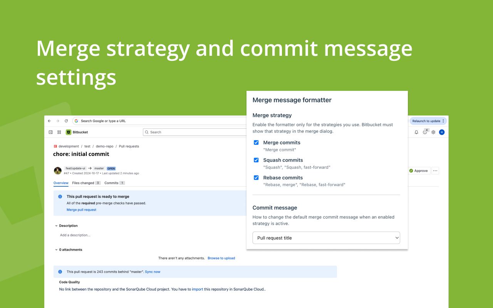
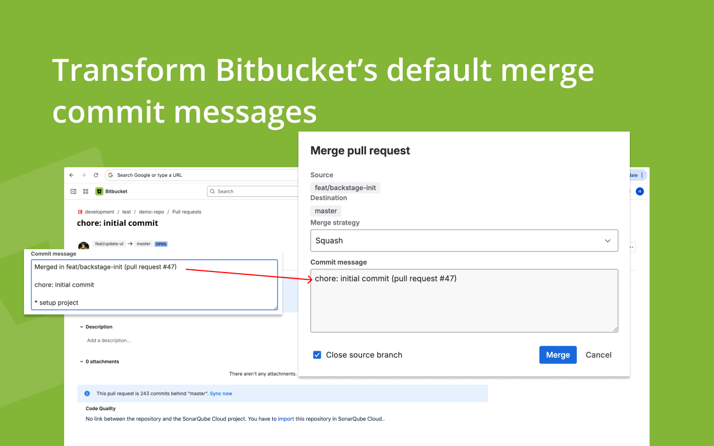

<p align="center">
  
</p>

# Bitbucket Buddy

Browser extension that **formats the merge commit message** on [Bitbucket](https://bitbucket.org) pull requests. Built with **TypeScript**, **Vite**, and the **CRXJS** plugin (vanilla DOM in the popup, side panel, and content scripts — no React).

## Screenshots

| Settings (popup / side panel) | Merge dialog |
| --- | --- |
|  |  |

## What it does

On Bitbucket PR pages (`/pull-requests/*`), when you open **Merge pull request**, the extension can rewrite Bitbucket’s default squash/merge message into a clearer format:

- **Pull request title** — single line: PR title plus `(pull request #N)`
- **Pull request title and commit details** — title line plus the body (commits list, bullets, etc.), matching the default install behavior

You can also leave **Default message** to keep Bitbucket’s text unchanged.

**Per merge strategy**, you choose whether the formatter runs for **Merge commit**, **Squash**, and **Rebase** (each can be toggled in settings). Settings are stored with the `storage` permission and shared between the **toolbar popup** (Chrome) and **side panel** / **Firefox sidebar**.

## Features

- Rewrites merge-dialog commit messages from Bitbucket’s `Merged in …` form when it matches the expected pattern
- Optional toast when a message is replaced
- Chrome **side panel** and Firefox **sidebar** for the same settings UI as the popup
- TypeScript, Vite, CRXJS; dual **Chrome** / **Firefox** manifests (`side_panel` vs `sidebar_action`)
- Production zips emitted under `release/` (`vite-plugin-zip-pack`; filenames use the `chrome-` / `firefox-` prefix, package name, and version from `package.json`)

## Quick start

1. Install dependencies:

```bash
npm install
```

2. Start the dev server:

```bash
npm run dev
```

3. **Chrome:** open `chrome://extensions/`, enable **Developer mode**, and **Load unpacked** from the `dist` directory after a build (or use the dev flow your CRXJS setup expects).

4. Build for production:

```bash
npm run build:chrome
# or
npm run build:firefox
```

`npm run build` runs both targets. Zipped packages are written to `release/`.

## Project structure

- `src/popup/` — Toolbar popup UI
- `src/sidepanel/` — Chrome side panel / Firefox sidebar UI
- `src/content/` — Content scripts (`bootstrap.ts`, merge message handling, toast)
- `src/lib/` — `extensionApi.ts`, `mountSettingsUi.ts`, `mergeFormatterSettings.ts`, `transformMergeMessage.ts`
- `src/components/` — Shared settings styles
- `manifest.config.ts` — Shared manifest (name, icons, content script matches, permissions)
- `manifest.chrome.ts` / `manifest.firefox.ts` — Picked via `TARGET_BROWSER` in `vite.config.ts`

## Documentation

- [Vite](https://vite.dev/)
- [CRXJS Vite plugin](https://crxjs.dev/vite-plugin)

## Development notes

- Adjust behavior or host permissions in `manifest.config.ts` and browser-specific manifests as needed (`npm run build:firefox` sets `TARGET_BROWSER=firefox`).
- CRXJS generates the final manifest; Firefox build uses a small Vite shim so the side panel HTML is bundled, then Chrome-only keys are stripped for Firefox output.
